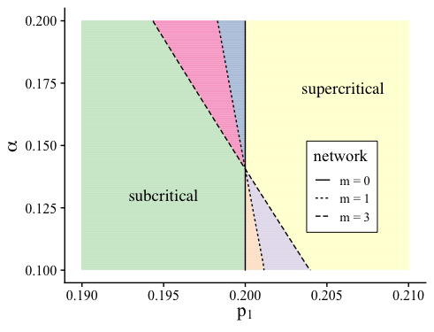
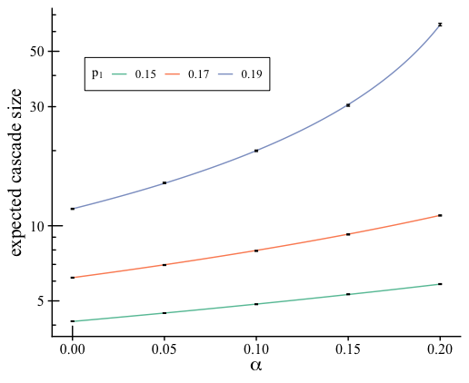

```{r setup, include=FALSE}
knitr::opts_chunk$set(echo = FALSE)
```

## Description of the files

1. The [mtbp_functions.R](https://github.com/leahkeating/MTBP_complex_contagion_on_clustered_networks/blob/main/mtbp_functions.R) file contains all of the functions required for the other files. The functions include:
    + A function to create the mean matrix (mean_mat( ))
    + A function that calculates the expected cascade size analytically (expected_size()). The analytical calculation of the expected cascade size is discussed in Sec. IV A.

2. The [cascade_condition.R](https://github.com/leahkeating/MTBP_complex_contagion_on_clustered_networks/blob/main/cascade_condition.R) file contains code to generate the plots showing the critical boundaries for the 4 networks, similarly to Fig. 3 in the paper.
    + The code details how to generate the boundary lines shown in the plots below.
```{r fig3, fig.align = 'center', out.width = "45%"}

knitr::include_graphics("20210624_clique_crit.png")

```

3. The [MTBP_simulations.R](https://github.com/leahkeating/MTBP_complex_contagion_on_clustered_networks/blob/main/MTBP_simulations.R) file contains the code for doing the branching process type simulations.
    + This file includes code for generating network-based simulations in order to plot Fig. 4(a), as shown below.
    
```{r fig4a, fig.align = 'center', out.width = "45%"}


```

4. The [expected_size.R](https://github.com/leahkeating/MTBP_complex_contagion_on_clustered_networks/blob/main/expected_size.R) file contains the code for generating Fig. 4(b) in the paper. This compares the analytical expected cascade size to the mean cascade size from simulations, as shown below.

```{r fig4b, fig.align = 'center', out.width = "45%"}


```

5. The [finite_size_limitations.R](https://github.com/leahkeating/MTBP_complex_contagion_on_clustered_networks/blob/main/finite_size_limitations.R) file contains the code required to generate Fig. 6 in the paper, as shown below.

```{r fig6, fig.align = 'center', out.width = "45%"}
knitr::include_graphics("20210625_finite_size.png")

```