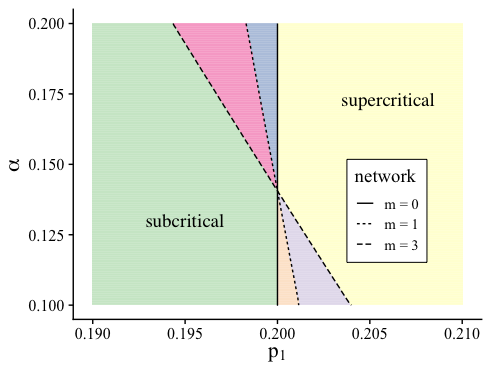

A Multi-Type Branching Process Method for Modelling Complex Contagion on
Clustered Networks
================

## Description of the files

1.  The
    [mtbp\_functions.R](https://github.com/leahkeating/MTBP_complex_contagion_on_clustered_networks/blob/main/mtbp_functions.R)
    file contains all of the functions required for the other files. The
    functions include:
      - A function to create the mean matrix (mean\_mat( ))
      - A function that calculates the expected cascade size
        analytically (expected\_size())
2.  The
    [cascade\_condition.R](https://github.com/leahkeating/MTBP_complex_contagion_on_clustered_networks/blob/main/cascade_condition.R)
    file contains code to generate the plots showing the critical
    boundaries for the 4 networks, similarly to Fig. 3 in the
paper.

